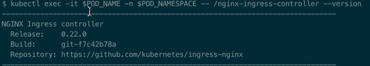
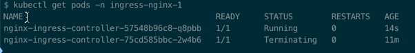
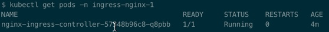
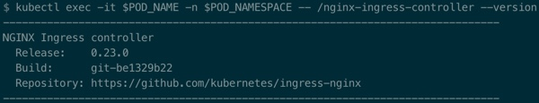

1. Check the version of ingress
    ```
    POD_NAMESPACE=ingress-nginx
    POD_NAME=$(kubectl get pods -n $POD_NAMESPACE -l app.kubernetes.io/name=ingress-nginx -o jsonpath='{.items[0].metadata.name}')
    kubectl exec -it $POD_NAME -n $POD_NAMESPACE -- /nginx-ingress-controller --version
    ```
    
2. Update the deployment resource in ```mandatory.yaml```
    ```
    image: quay.io/kubernetes-ingress-controller/nginx-ingress-controller:0.23.0
    ```
3. Apply the configuration
    ```
    kubectl apply -f mandatory.yaml
    ```
4. Wait for 3-5 minutes and check the version
    - Monitor pods using ```watch``` to visualize the new pod creation and termination of old pod.

    
    - Once the new pod is created and old pod is terminated we will see the below output.

    
5. Verify the version of ingress.
    ```
    POD_NAME=$(kubectl get pods -n $POD_NAMESPACE -l app.kubernetes.io/name=ingress-nginx -o jsonpath='{.items[0].metadata.name}')
    kubectl exec -it $POD_NAME -n $POD_NAMESPACE -- /nginx-ingress-controller --version
    ```
    - We need to re-assign the POD_NAME environment variable because the pod name has changed due to the creation of new pod.

    
